# VPP Pricing Research Toolkit

Forschungs-Framework zum systematischen Vergleich von Bewertungsmethoden fuer Virtual Power Plants (VPPs).

## Motivation

Die Bewertung eines VPP-Portfolios haengt stark davon ab, welcher reale
Erlosstrom gepreist wird: Spot-/Intraday-Arbitrage, Bilanzkreisoptimierung,
Regelenergie, Demand Response, Retail-Tarife, PPA/Route-to-Market oder lokale
Netzflexibilitaet. Dieses Toolkit stellt deshalb erst die praxisnahen
Pricing-Archetypen in den Mittelpunkt und ordnet die implementierten Methoden
diesen Archetypen zu.

Siehe auch: `docs/practical_vpp_pricing.md`.

## Praxis-Archetypen

| Archetyp | Oekonomische Rolle | Typische Nutzer | Repo-Status |
|---|---|---|---|
| Intrinsic Benchmark | Obere Schranke und Opportunitaetskosten | Asset Owner, Analysten, Kreditgeber | `intrinsic` |
| Rolling Forecast Dispatch | Ausfuehrbare Intraday-/Bilanzkreisoptimierung | Aggregatoren, BRPs, Batteriespeichervermarkter | `rolling_intrinsic` |
| Stochastic Merchant Bidding | Probabilistische Merchant- und Tail-Bewertung | Storage-Owner, Optimierer, Trading Desks | `monte_carlo` |
| Balancing / Ancillary Services | Praequalifizierte Leistung plus Aktivierung | BSPs, C&I-DR, VPP-Aggregatoren | geplant |
| Retail Tariff Flex | Kundengeraete fuer Retail- und Netzflexibilitaet | Retailer, Utilities, Residential-VPPs | geplant |
| Hedged Route-to-Market | PPA-/Direktvermarktung plus Rest-Bilanzrisiko | Erneuerbare, PPAs, Utility Desks | geplant |
| Network Flex / Non-Wires | Lokale Flexibilitaet gegen Netzengpaesse | DSOs, Utilities, lokale Flex-Plattformen | geplant |

## Implementierte Pricing-Methoden

| Methode | Beschreibung | Staerken | Grenzen |
|---|---|---|---|
| **Intrinsic Value** | Perfekte Voraussicht ueber den gesamten Lieferzeitraum. Jedes Asset optimiert gegen die vollstaendige Preiskurve. | Obere Schranke, deterministisch, schnell | Keine executable Trading-Strategie |
| **Rolling Intrinsic** | Rollierende Optimierung mit begrenztem Vorhersagefenster. Batterien und flexible Lasten werden je Fenster optimiert, Commit nur fuer die aktuelle Stunde. | Naeher an operativer Bilanzkreis-/Intraday-Praxis | Innerhalb des Fensters weiterhin perfekte Voraussicht; keine Forecast-Fehler |
| **Monte-Carlo Extrinsic** | AR(1)-Preispfad-Simulation um Basiskurven mit konfigurierbarer Mean-Reversion, Drift-Korrektur und additiver Behandlung von Null-/Negativpreisen. Optional mit rollierender Dispatch-Policy je Pfad via `--mc-dispatch-window-hours`. | Erfasst Optionswert-Sensitivitaet, Tail-Risiko und Streuung | Default bleibt per-path perfect foresight; noch kein Multi-Market-Bidding |

---

## Analyseergebnisse

Alle Ergebnisse basieren auf den mitgelieferten Beispieldaten in `examples/`.
Reproduzierbar via `PYTHONPATH=src python examples/run_analyses.py`.
Die Beispielanalysen nutzen 80 Monte-Carlo-Pfade je Vergleich und Seed 42, damit
die Chart-Generierung reproduzierbar und fuer lokale Doku-Laeufe praktikabel bleibt.

### Marktdaten

Das Toolkit enthaelt fuenf Marktdaten-Sets mit unterschiedlicher zeitlicher Aufloesung, Saisonalitaet und Tail-Tiefe:

| Dataset | Intervall | Szenarien | Zeitraum | Preisrange (EUR/MWh) |
|---|---|---|---|---|
| `scenario_prices.csv` | 1h | 3 (low/base/stress) | 1 Wintertag | -8 bis 240 |
| `extended_scenarios.csv` | 1h | 5 (deep_low bis scarcity) | 1 Wintertag | -46 bis 520 |
| `summer_day_scenarios.csv` | 1h | 5 (solar_surplus bis heat_wave) | 1 Sommertag | -85 bis 380 |
| `week_scenarios.csv` | 1h | 5 (deep_low bis scarcity) | 7 Wintertage | -60 bis 520 |
| `quarter_hourly_scenarios.csv` | 15min | 3 (low/base/stress) | 1 Wintertag | 15 bis 181 |

#### Wintertag - 5 Szenarien mit Scarcity-Spikes und Negativpreisen

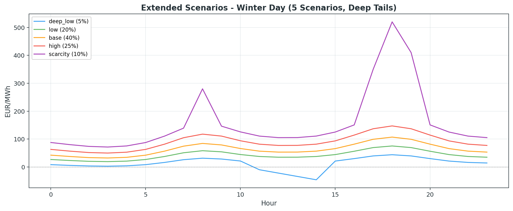

Das `scarcity`-Szenario (10% Wahrscheinlichkeit) enthaelt Preisspitzen bis 520 EUR/MWh am Abend.
Das `deep_low`-Szenario (5%) zeigt mehrstuendige Negativpreise bis -46 EUR/MWh zur Mittagszeit.

#### Sommertag - Duck Curve mit Solar-Kannibalisierung

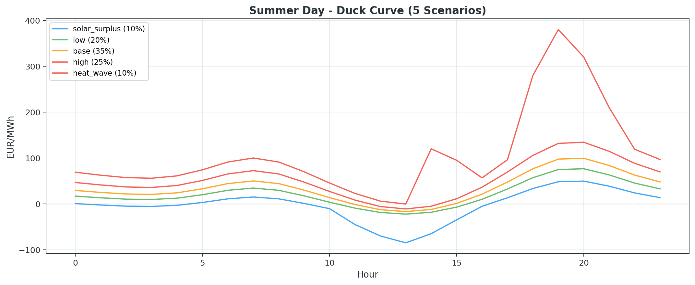

Das `solar_surplus`-Szenario bildet die typische Duck Curve ab: Negativpreise bis -85 EUR/MWh
durch Solar-Ueberangebot zur Mittagszeit, gefolgt von einem steilen Abend-Ramp.
Im `heat_wave`-Szenario treiben Kuehllast und wegfallende Solarleistung Abendpreise auf 380 EUR/MWh.

### VPP-Portfolios

Sechs Portfolios decken die wichtigsten VPP-Archetypen ab:

| Portfolio | Assets | Beschreibung |
|---|---|---|
| `sample_portfolio.json` | Solar, Wind, Batterie, Flex-Last, Fix-Last, Gas-Peaker | Referenz-VPP mit gemischtem Asset-Mix |
| `merchant_bess.json` | 100 MWh / 50 MW Batterie | Grossspeicher fuer Merchant-Arbitrage |
| `renewable_hybrid.json` | 15 MW Solar + 8 MW Wind + 30 MWh BESS | Co-located Hybrid-Park |
| `storage_only.json` | 2 Batterien (20 + 8 MWh) | Reines Speicher-Portfolio |
| `industrial_site.json` | PV + Fabrik-Last + BTM-Batterie + Kuehlung + Diesel | Industriestandort hinter dem Zaehler |
| `demand_response.json` | Waermepumpen + EV + HVAC + Home-Batteries + Grundlast | DR-Aggregation |

### Ergebnisuebersicht: Alle Portfolios

Die folgende Tabelle zeigt die Ergebnisse aller Portfolios gegen das erweiterte Szenario-Set (5 Szenarien, 24h):

| Portfolio | Methode | E[V] EUR | Std EUR | CaR EUR | CVaR EUR | Capture |
|---|---|---:|---:|---:|---:|---:|
| **Demo VPP** | Intrinsic | 3,117 | 2,838 | 1,433 | 1,433 | 100.0% |
| | Rolling (6h) | 2,605 | 2,735 | 1,070 | 1,070 | 83.6% |
| | Monte Carlo | 2,947 | 3,218 | 1,085 | 960 | 94.5% |
| **Merchant BESS** | Intrinsic | 9,213 | 10,671 | 3,813 | 3,813 | 100.0% |
| | Rolling (8h) | 9,213 | 10,671 | 3,813 | 3,813 | 100.0% |
| | Monte Carlo | 11,280 | 12,460 | 4,230 | 3,562 | 122.4% |
| **Renewable Hybrid** | Intrinsic | 15,892 | 8,329 | 4,694 | 4,694 | 100.0% |
| | Rolling (6h) | 15,855 | 8,320 | 4,690 | 4,690 | 99.8% |
| | Monte Carlo | 16,218 | 9,336 | 7,145 | 4,578 | 102.1% |
| **Storage Only** | Intrinsic | 2,993 | 3,339 | 1,298 | 1,298 | 100.0% |
| | Rolling (8h) | 2,993 | 3,339 | 1,298 | 1,298 | 100.0% |
| | Monte Carlo | 3,634 | 3,823 | 1,477 | 1,221 | 121.4% |
| **Industrial Site** | Intrinsic | -2,534 | 912 | -3,638 | -3,638 | 100.0% |
| | Rolling (6h) | -2,702 | 963 | -3,895 | -3,895 | 93.4% |
| | Monte Carlo | -2,602 | 967 | -3,919 | -4,143 | 97.3% |
| **Demand Response** | Intrinsic | -8,512 | 3,824 | -16,346 | -16,346 | 100.0% |
| | Rolling (6h) | -9,799 | 4,209 | -18,307 | -18,307 | 84.9% |
| | Monte Carlo | -9,548 | 4,504 | -18,844 | -21,097 | 87.8% |

### Capture Ratio ueber alle Archetypen

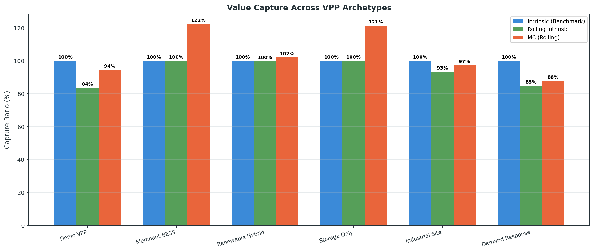

**Interpretation:**
- **Speicher-dominierte Portfolios** (Merchant BESS, Storage Only) zeigen den hoechsten MC-Capture >115%.
  Das liegt an hoeherer Pfadvolatilitaet und rollierendem Dispatch innerhalb der simulierten Pfade.
  Der Wert ist eine Sensitivitaet, kein automatisch realisierbares Extrinsic-Premium.
- **Erneuerbare-dominierte Portfolios** (Renewable Hybrid) zeigen MC nahe 100% -
  Solaranlagen und Windanlagen koennen Preisvolatilitaet kaum aktiv ausnutzen.
- **Last-dominierte Portfolios** (Industrial Site, Demand Response) zeigen MC Capture <100%.
  Rollierende flexible Lasten sehen nur das Forecast-Fenster und koennen guenstige Full-Horizon-Zeitpunkte verpassen.
- **Rolling Intrinsic** ist fuer reine Speicher mit ausreichendem Fenster fast identisch zum Intrinsic-Benchmark.
  Bei Portfolios mit viel flexibler Last faellt der Wertverlust auch bei 6h-Fenstern deutlich aus.

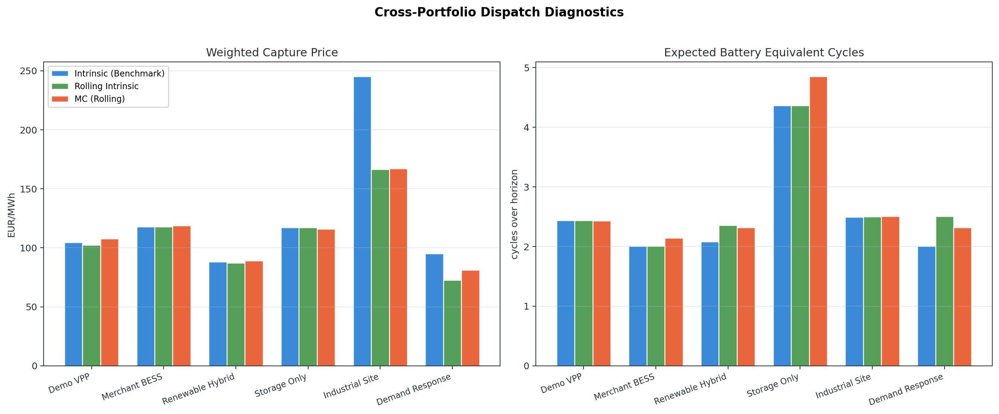

Die Dispatch-Diagnostik ergaenzt die reine Bewertung um Capture Price und erwartete Batteriezyklen.
Damit werden zwei operative Fragen sichtbar: ob der Wert aus guenstigem Preis-Capture oder aus
mehr Durchsatz kommt, und ob die Zyklenannahmen mit Degradation und Garantiebedingungen vereinbar sind.

### Merchant BESS - Methodenvergleich

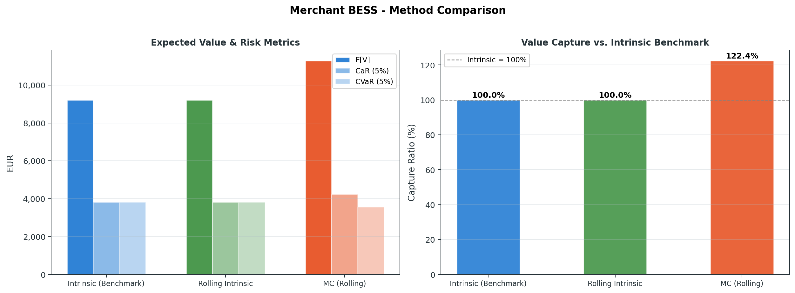

Der 100 MWh / 50 MW Grossspeicher zeigt die schaerfsten Methoden-Unterschiede:
- Intrinsic und Rolling (8h) sind identisch - das 8h-Fenster reicht fuer das 24h-Arbitrage-Profil.
- Monte Carlo liegt +22.4% ueber Intrinsic durch zusaetzliche Pfadvolatilitaet.

### Merchant BESS - Scarcity-Dispatch

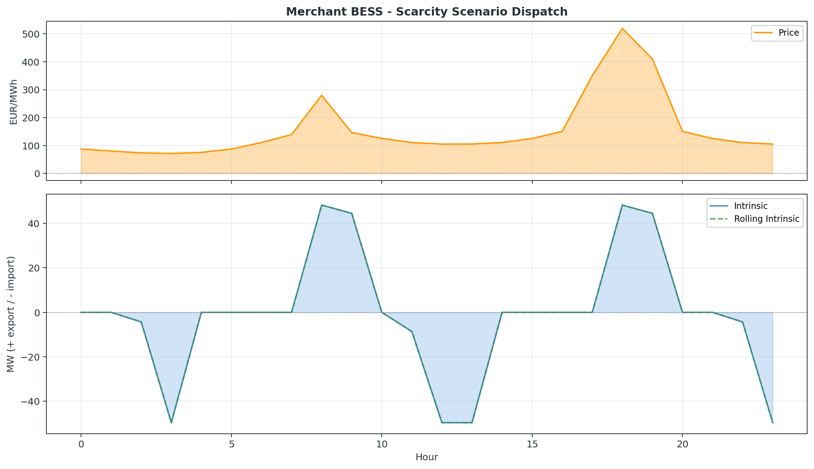

Im Scarcity-Szenario (Preise bis 520 EUR/MWh) laesst sich beobachten:
- Die Batterie laedt in den guenstigen Nachtstunden und entlaedt praezise in die beiden Preisspitzen (08:00 und 18:00).
- Intrinsic und Rolling zeigen identisches Verhalten - perfect foresight innerhalb des 8h-Fensters reicht aus.

### Sommer-Analyse: Duck Curve mit Renewable Hybrid

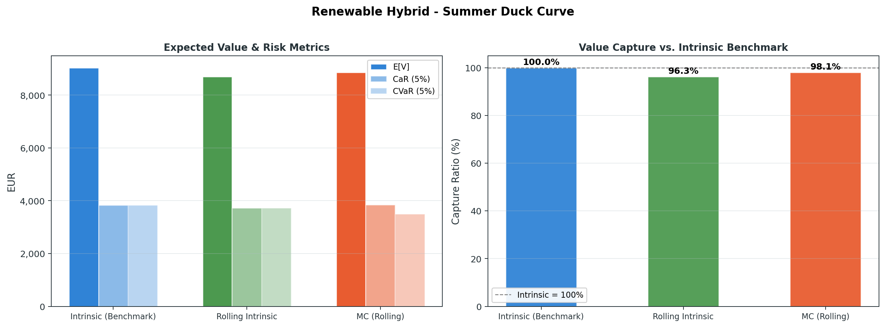

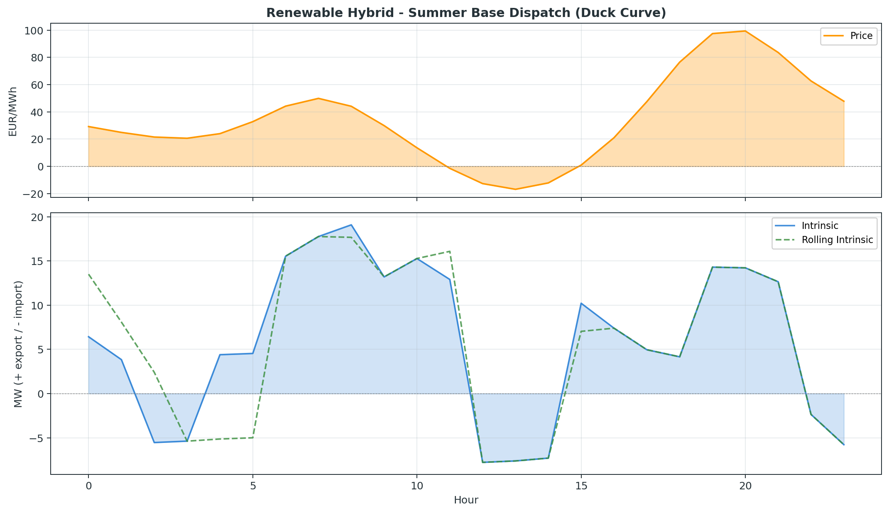

Im Sommer-Base-Szenario wird der Duck-Curve-Effekt deutlich:
- Mittags importiert das Portfolio (Batterie laedt bei niedrigen/negativen Preisen).
- Abends exportiert es in den Ramp-Peak (maximaler Preis ~100 EUR/MWh).
- Rolling Intrinsic (4h-Fenster) erfasst 96.3% - der kuerzere Horizont fuehrt zu leichter Suboptimalitaet bei der Batterie-Positionierung.

### Sensitivitaetsanalysen

#### Rolling Intrinsic: Fenstergroesse

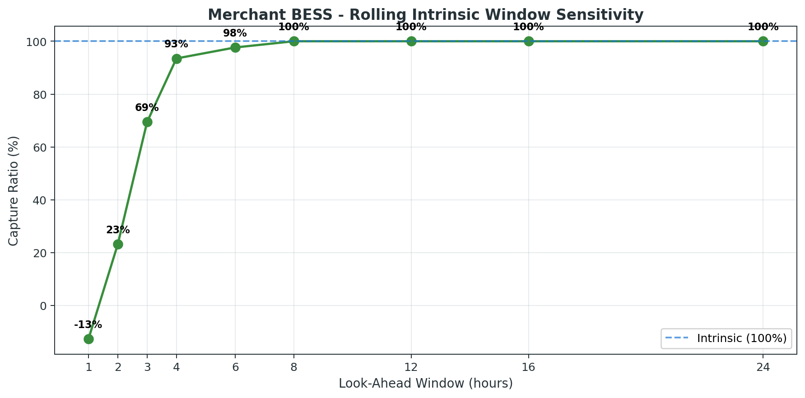

Die Fenster-Sensitivitaet des Merchant BESS zeigt:

| Fenster | Capture | Interpretation |
|---:|---:|---|
| 1h | -13% | Voellig unzureichend - Batterie kann keinen sinnvollen Arbitrage planen |
| 2h | 23% | Minimaler Wert, da Spread zwischen aufeinanderfolgenden Stunden begrenzt |
| 4h | 94% | Erfasst den Grossteil des Morgen-/Abend-Spreads |
| 6h | 98% | Nahezu vollstaendige Werterfassung |
| 8h+ | 100% | Identisch mit Intrinsic fuer das 24h-Profil |

**Fazit:** Fuer Day-Ahead-Batterieoptimierung sind 4-6h Vorhersage-Fenster ausreichend.
Unter 3h geht signifikanter Wert verloren.

#### Monte Carlo: Volatilitaets-Sensitivitaet

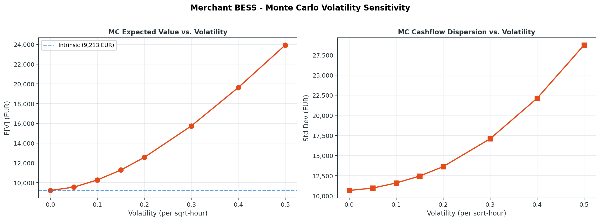

Die MC-Volatilitaets-Analyse zeigt:
- Bei vol=0 entspricht MC exakt dem Intrinsic-Wert (9,213 EUR).
- Der E[V]-Anstieg mit Volatilitaet ist **monoton und konvex** - ein Hinweis auf starke Pfadoptionalitaet.
- Bei vol=0.50 liegt MC bei 23,933 EUR (+160% vs. Intrinsic).
- Die Standardabweichung steigt erst ab vol>0.20 merklich - die Pfadvolatilitaet erzeugt asymmetrisch mehr Upside als Downside fuer optimierbare Assets.

**Warnung:** In der Praxis ist der MC E[V] > Intrinsic E[V] kein Extrinsic-Value-Premium,
sondern muss gegen Forecast-Qualitaet, Ausfuehrbarkeit, Liquiditaet und Degradation validiert werden.

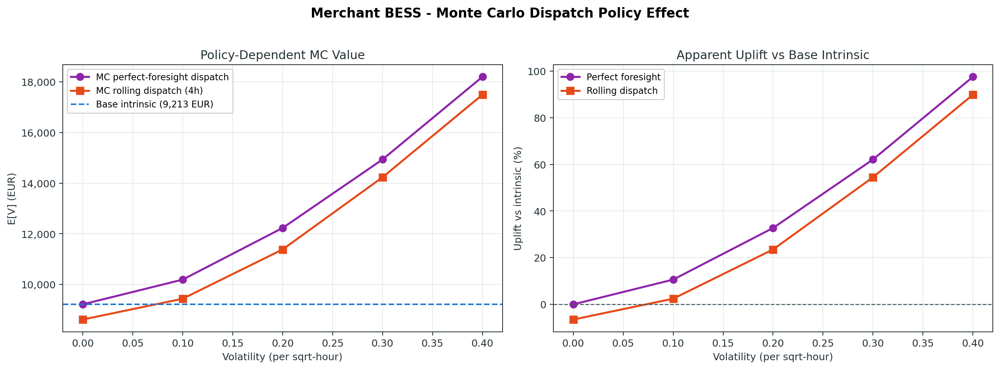

Der Policy-Vergleich trennt den Preisprozess vom Dispatch-Modell: Perfect-Foresight-MC zeigt die obere
Grenze je Pfad, waehrend ein 4h-rollierender Dispatch die operative Umsetzbarkeit konservativer abbildet.

### Quarter-Hourly Analyse (15-min)

| Methode | E[V] EUR | Capture |
|---|---:|---:|
| Intrinsic | 441 | 100.0% |
| Rolling (1.5h) | 312 | 70.7% |
| Monte Carlo | 426 | 96.6% |

Bei 15-min-Aufloesung mit nur 1.5h-Fenster erfasst Rolling Intrinsic nur 70.7%.
Sub-hourly-Maerkte erfordern laengere Fenster relativ zur Intervalllaenge.

---

## Projektstruktur

```
src/vpp_pricing/
    __init__.py              # Public API
    assets.py                # Asset-Modelle (Solar, Wind, Batterie, Last, Generator)
    market.py                # Marktdaten und CSV-Import
    portfolio.py             # Portfolio-Aggregation
    practical.py             # Praxis-Archetypen, Nutzergruppen, Mispricing-Risiken
    results.py               # Dispatch- und Ergebnis-Datenstrukturen
    risk.py                  # Gewichtete Erwartungs-, CaR-, CVaR- und Streuungsmetriken
    pricing.py               # Legacy-API (delegiert an Intrinsic)
    comparison.py            # Side-by-side Methodenvergleich mit Mispricing-Warnungen
    diagnostics.py           # Capture Price, Dispatch-, Markt- und Zyklen-Diagnostik
    methods/
        __init__.py          # Registry und get_method()
        base.py              # PricingMethod Protocol, PricingResult
        intrinsic.py         # Intrinsic Value
        rolling_intrinsic.py # Rolling Intrinsic
        monte_carlo.py       # Monte-Carlo Extrinsic (AR(1) mit Drift-Korrektur)
tests/
    test_assets.py           # Asset-Dispatch-Tests
    test_pricing.py          # Pricing-Methoden-Tests
    test_practical.py        # Praxis-Archetypen-Tests
    test_monte_carlo.py      # MC Drift-Korrektur und Sensitivitaeten
    test_comparison.py       # Mispricing-Warnungen und Capture Ratio
docs/
    practical_vpp_pricing.md # Ausfuehrliche Praxis-Dokumentation
    img/                     # Generierte Analyse-Charts
examples/
    sample_portfolio.json    # Referenz-VPP
    merchant_bess.json       # 100 MWh Grossspeicher
    renewable_hybrid.json    # Solar + Wind + BESS
    storage_only.json        # 2 Batterien
    industrial_site.json     # Industriestandort BTM
    demand_response.json     # DR-Aggregation
    quarter_hourly_portfolio.json  # 15-min-Flex-Portfolio
    run_analyses.py          # Analyse-Skript (erzeugt alle Charts)
    data/
        day_ahead_prices.csv
        scenario_prices.csv
        extended_scenarios.csv
        summer_day_scenarios.csv
        week_scenarios.csv
        quarter_hourly_scenarios.csv
```

## Schnellstart

```bash
# Installation
pip install -e ".[dev]"

# Einzelbewertung (Intrinsic)
vpp-price price examples/sample_portfolio.json examples/data/day_ahead_prices.csv

# Methodenvergleich mit erweiterten Szenarien
vpp-price compare examples/merchant_bess.json examples/data/extended_scenarios.csv \
    --scenario-column scenario \
    --probability-column probability

# Sommer-Duck-Curve-Analyse
vpp-price compare examples/renewable_hybrid.json examples/data/summer_day_scenarios.csv \
    --scenario-column scenario \
    --probability-column probability \
    --window-hours 4 \
    --mc-paths 300

# 15-min-Markt
vpp-price compare examples/quarter_hourly_portfolio.json \
    examples/data/quarter_hourly_scenarios.csv \
    --scenario-column scenario \
    --probability-column probability \
    --timestep-hours 0.25 \
    --window-hours 1.5

# Wochenanalyse
vpp-price compare examples/storage_only.json examples/data/week_scenarios.csv \
    --scenario-column scenario \
    --probability-column probability \
    --window-hours 12

# Vergleich mit allen Parametern
vpp-price compare examples/sample_portfolio.json examples/data/extended_scenarios.csv \
    --scenario-column scenario \
    --probability-column probability \
    --methods intrinsic rolling_intrinsic monte_carlo \
    --window-hours 4 \
    --mc-paths 200 \
    --mc-volatility 0.20 \
    --mc-mean-reversion 0.7 \
    --mc-dispatch-window-hours 4 \
    --output runner_outputs/comparison.json

# Praxis-Archetypen und Mispricing-Risiken anzeigen
vpp-price approaches --json

# Alle Analysen und Charts reproduzieren
PYTHONPATH=src python examples/run_analyses.py

# Tests
pytest
```

## CLI-Ausgabeformat

`vpp-price compare` zeigt Approach-Zuordnung, Capture Ratio und Mispricing-Warnungen.
Konsole und JSON enthalten zusaetzlich Dispatch-Diagnostik wie Export/Import-MWh,
Capture Price, negative-price exposure und Batteriezyklen:

```
==================================================================================================
  VPP PRICING METHOD COMPARISON -- Merchant BESS 2h
==================================================================================================
  Base scenarios: 5

  Method                 Approach               E[V] EUR    Std EUR      CaR EUR     CVaR EUR  Capture%
  ------------------------------------------------------------------------------------------------
  intrinsic              benchmark_intrinsic      9213.36   10671.41      3812.60      3812.60    100.0%
  rolling_intrinsic      rolling_forecast_dispatch 9213.36  10671.41      3812.60      3812.60    100.0%
  monte_carlo            stochastic_merchant_bidding 11280.02 12459.87    4229.98      3561.93    122.4%

  Delta vs. intrinsic (perfect-foresight benchmark):
    rolling_intrinsic             +0.00 EUR  (+0.0%)
    monte_carlo                +2066.66 EUR  (+22.4%)

  Mispricing warnings:
    * intrinsic: perfect-foresight upper bound, not an executable strategy
    * monte_carlo E[V] exceeds base-scenario intrinsic - simulated path volatility
      and the selected dispatch policy can create apparent uplift
    * rolling_intrinsic: still uses known prices within window (no forecast error modelled)
==================================================================================================
```

## Quantitative Methodik

- Alle Methoden nutzen dieselbe gewichtete Risk-Engine fuer Erwartungswert, Standardabweichung, CaR und CVaR.
- Szenariowahrscheinlichkeiten werden normalisiert; wenn alle Gewichte null sind, wird gleichgewichtet.
- Capture Ratio ist sign-aware definiert als `100 + (method_value - intrinsic_value) / abs(intrinsic_value) * 100`.
  Dadurch bedeuten niedrigere Werte bei negativen Portfolio-Cashflows tatsaechlich hoehere Kosten gegenueber Intrinsic.
- Rolling Intrinsic optimiert Batterien und flexible Lasten mit begrenztem Look-ahead; fixe Lasten, erneuerbare Profile
  und einfache Generatoren bleiben deterministisch gegen die jeweilige Preiskurve.
- Flexible Lasten behalten ihre Gesamtenergie ein; ausserhalb des Forecast-Fensters wird nur Feasibility,
  aber kein Future-Price-Terminalwert angesetzt. Das macht kurze Fenster bewusst konservativ/myopisch.
- Monte Carlo verteilt die Pfadanzahl proportional auf die Basisszenarien und erbt deren Wahrscheinlichkeiten.
- Der MC-Preispfad-Generator nutzt ein AR(1)-Schock-Modell mit exakter Varianz-basierter Drift-Korrektur,
  sodass E[sim_price] = base_price (unbiased) fuer jeden Zeitschritt gilt.
- Null- und Negativpreise werden additiv mit einem EUR/MWh-Preis-Skalenfloor simuliert, statt lognormal multipliziert.
- Mean-Reversion (0 = unabhaengige Schocks, nahe 1 = persistent) ist konfigurierbar via `--mc-mean-reversion`.
- Marktdaten werden auf endliche Preise, konsistente Szenario-Wahrscheinlichkeiten und vergleichbare Zeitachsen geprueft.
- Der Vergleichsoutput enthaelt automatische Mispricing-Warnungen, die Nutzer auf methodenspezifische Verzerrungen hinweisen.

## Programmatische Nutzung

```python
from vpp_pricing import (
    VirtualPowerPlant,
    load_market_csv,
    compare_methods,
    IntrinsicPricing,
    RollingIntrinsicPricing,
    MonteCarloPricing,
)

portfolio = VirtualPowerPlant.from_json("examples/merchant_bess.json")
markets = load_market_csv(
    "examples/data/extended_scenarios.csv",
    scenario_column="scenario",
    probability_column="probability",
)

result = compare_methods(
    portfolio,
    markets,
    methods=[
        IntrinsicPricing(),
        RollingIntrinsicPricing(window_hours=6),
        MonteCarloPricing(num_paths=500, volatility=0.20, mean_reversion=0.7, seed=42),
    ],
    risk_aversion=0.5,
    alpha=0.05,
)

for row in result.summary_table():
    print(
        f"{row['method']} ({row['practical_approach']}): "
        f"E[V]={row['expected_value_eur']:.2f} EUR  "
        f"Capture={row['capture_ratio_pct']:.1f}%"
    )

# Mispricing-Warnungen pruefen
for warning in result.mispricing_warnings():
    print(f"  WARNING: {warning}")
```

## Eigene Pricing-Methode hinzufuegen

Jede Klasse, die das `PricingMethod`-Protocol implementiert, ist kompatibel:

```python
from dataclasses import dataclass
from vpp_pricing.methods.base import PricingMethod, PricingResult
from vpp_pricing.market import MarketData
from vpp_pricing.portfolio import VirtualPowerPlant

@dataclass
class MyCustomPricing:
    @property
    def name(self) -> str:
        return "my_custom"

    def price(
        self,
        portfolio: VirtualPowerPlant,
        markets: list[MarketData],
        *,
        risk_aversion: float = 0.0,
        alpha: float = 0.05,
    ) -> PricingResult:
        # Eigene Bewertungslogik hier
        ...
```

## Modellannahmen und Grenzen

Dieses Toolkit modelliert Energie-Cashflows gegen exogene Preise. Bewusst nicht enthalten (aber als Erweiterung moeglich):

- Explizite Regelenergieprodukte mit Verfuegbarkeits- und Aktivierungserloesen
- Netzrestriktionen, lokale Flexibilitaet und Engpassmanagement
- Bilanzkreisabweichungen, Ausgleichsenergie und Penalty-Mechaniken
- Intraday-Liquiditaet, Bid-Ask-Spreads und Orderbuch-Ausfuehrung
- Start-/Stoppkosten und Mindeststillstandszeiten
- PPA-/Hedge-Strukturen, Shape Risk und Collateral
- Demand-Response-Baselines, Opt-outs, Rebound und Kundennutzen
- Regulatorische Abgaben (EEG, Netzentgelte)
- Nichtlineare Batterie-Degradation (DoD-abhaengig, Calendar Aging)
- Revenue-Stacking-Guards (Exklusivitaet ueber Produkte)
- Forecast-Error-Modellierung im Rolling Dispatch
- Kalibrierte operative MC-Dispatch-Policies mit Liquiditaet, Bid-Ask-Spreads und Ausfuehrungsrisiko
