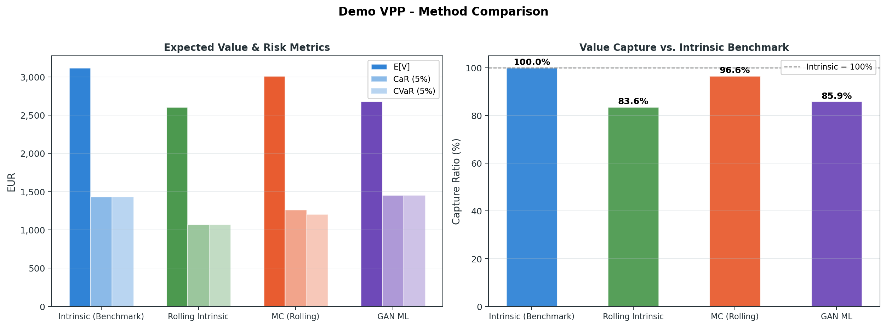

# VPP Pricing Research Toolkit

Forschungs-Framework zum systematischen Vergleich von Bewertungsmethoden fuer
Virtual Power Plants (VPPs). Der Fokus liegt auf nachvollziehbaren
Modellannahmen, konsistenten Eingabedaten, Dispatch-Diagnostik und expliziten
Warnungen vor methodischen Fehlinterpretationen.

## Was dieses Repo leisten soll

- **Belastbare Vergleichbarkeit:** Intrinsic, Rolling Intrinsic, Monte Carlo,
  GAN-Szenario-Baseline und eine leichte tabellarische RL-Baseline laufen ueber
  dieselbe Risk- und Diagnostics-Pipeline.
- **Pruefbare Eingaben:** Portfolio-JSON und Market-CSV koennen mit
  `vpp-price validate` vor dem Pricing geprueft werden.
- **Klare Grenzen:** Intrinsic ist ein Benchmark, MC/GAN/RL-Uplift ist kein
  automatisch ausfuehrbarer Trading-Mehrwert, und kurze Trainingssets werden
  explizit als Risiko markiert.
- **VPP statt Einzelasset:** Ergebnisreports enthalten Asset-Mix, Cashflow-,
  Export- und Import-Beitraege je Asset-Typ, erneuerbare Curtailment-MWh,
  flexible-Last-Wert, Capture Price, Negativpreis-Exposure und Batteriezyklen.

Siehe auch: `docs/input_contract.md` fuer den Eingabevertrag,
`docs/methodology.md` fuer Methodik, Risikodefinitionen und Modellgrenzen sowie
`docs/literature_comparison.md` fuer den Vergleich mit wissenschaftlichen
Veroeffentlichungen zu VPPs, Flexibilitaet, Speicher und Intraday-Maerkten.

## Motivation

Die Bewertung eines VPP-Portfolios haengt stark davon ab, welche Rolle der
Aggregator spielt: Bilanzkreisoptimierung fuer erneuerbare Portfolios,
Demand-Response-Abruf, Retail-Flexibilitaet, PPA-/Route-to-Market-Management,
lokale Netzflexibilitaet oder Merchant-Optionalitaet. Speicher sind dabei eine
Flexibilitaetskomponente, nicht der Zweck des Repos. Dieses Toolkit stellt
deshalb erst die VPP-Archetypen in den Mittelpunkt und ordnet die implementierten
Methoden diesen wirtschaftlichen Fragen zu.

Siehe auch: `docs/practical_vpp_pricing.md`.

## Praxis-Archetypen

| Archetyp | Oekonomische Rolle | Typische Nutzer | Repo-Status |
|---|---|---|---|
| Intrinsic Benchmark | Obere Schranke und Opportunitaetskosten | Asset Owner, Analysten, Kreditgeber | `intrinsic` |
| Rolling Forecast Dispatch | Ausfuehrbare Intraday-/Bilanzkreisoptimierung | Aggregatoren, BRPs, Hybrid- und Flex-Portfolios | `rolling_intrinsic` |
| Stochastic VPP Scenario Pricing | Probabilistische Bewertung von Portfolio-Cashflows und Tail-Risiko | Aggregatoren, Optimierer, Trading-/Risk-Teams | `monte_carlo` |
| GAN Scenario Generation | ML-basierte Szenario-Erweiterung und Stress-Tests | Quant Desks, RTM-Analysten, VPP-Research | `gan` |
| Tabular RL Dispatch Baseline | Didaktischer Batterie-Policy-Vergleich als Zusatzbaseline | Research Analysts, Methodik-Reviewer | `rl` |
| Balancing / Ancillary Services | Praequalifizierte Leistung plus Aktivierung | BSPs, C&I-DR, VPP-Aggregatoren | geplant |
| Retail Tariff Flex | Kundengeraete fuer Retail- und Netzflexibilitaet | Retailer, Utilities, Residential-VPPs | geplant |
| Hedged Route-to-Market | PPA-/Direktvermarktung plus Rest-Bilanzrisiko | Erneuerbare, PPAs, Utility Desks | geplant |
| Network Flex / Non-Wires | Lokale Flexibilitaet gegen Netzengpaesse | DSOs, Utilities, lokale Flex-Plattformen | geplant |

## Implementierte Pricing-Methoden

| Methode | Beschreibung | Staerken | Grenzen |
|---|---|---|---|
| **Intrinsic Value** | Perfekte Voraussicht ueber den gesamten Lieferzeitraum. Jedes Asset optimiert gegen die vollstaendige Preiskurve. | Obere Schranke, deterministisch, schnell | Keine executable Trading-Strategie |
| **Rolling Intrinsic** | Rollierende Optimierung mit begrenztem Vorhersagefenster. Batterien und flexible Lasten werden je Fenster optimiert, fixe Lasten, erneuerbare Profile und einfache Generatoren laufen als Portfolio-Komponenten mit. | Naeher an operativer Bilanzkreis-/Intraday-Praxis fuer VPPs | Innerhalb des Fensters weiterhin perfekte Voraussicht; keine Forecast-Fehler |
| **Monte-Carlo Scenario Pricing** | Displaced-lognormale AR(1)-Preispfad-Simulation um Basiskurven mit konfigurierbarer Mean-Reversion, Drift-Korrektur und einheitlicher Behandlung von positiven, nullnahen und negativen Preisen. Optional mit rollierender Dispatch-Policy je Pfad via `--mc-dispatch-window-hours`. | Erfasst Cashflow-Streuung, Tail-Risiko und Portfolio-Optionalitaet | Default bleibt per-path perfect foresight; noch kein Multi-Market-Bidding |
| **GAN ML Scenario Pricing** | Dependency-freier Generator-/Diskriminator-Ansatz, der normalisierte Strompreis-Kurven lernt und synthetische Pfade fuer Dispatch und Risikometriken erzeugt. Optional mit rollierender Dispatch-Policy via `--gan-dispatch-window-hours`. | Datengetriebene Szenario-Erweiterung, nichtlineare Preisformen, ML-Vergleich gegen MC | Kleine Szenario-Sets koennen Overfitting oder Mode Collapse erzeugen; kein Ersatz fuer Out-of-sample-Kalibrierung |
| **Reinforcement Learning** | Tabellarisches episodisches Q-Learning fuer Batterie-Dispatch mit diskretem State aus Resthorizont, SOC-Bin, Preis-Bin und Momentum-Bin. | Didaktische Zusatzbaseline fuer eine Flex-Komponente im Portfolio | Batterie-only, stark diskretisierungs- und szenarioabhaengig; kein VPP-weites Bidding- oder Steuerungsmodell |

---

## Analyseergebnisse

Alle Ergebnisse basieren auf den mitgelieferten Beispieldaten in `examples/`.
Reproduzierbar via `PYTHONPATH=src python examples/run_analyses.py`.
Die Beispielanalysen nutzen 40 Monte-Carlo-Pfade, 16 GAN-Pfade und Seed 42, damit
die Chart-Generierung reproduzierbar und fuer lokale Doku-Laeufe praktikabel bleibt.

### Marktdaten

Das Toolkit enthaelt fuenf Marktdaten-Sets mit unterschiedlicher zeitlicher Aufloesung, Saisonalitaet und Tail-Tiefe:

| Dataset | Intervall | Szenarien | Zeitraum | Preisrange (EUR/MWh) |
|---|---|---|---|---|
| `scenario_prices.csv` | 1h | 3 (low/base/stress) | 1 Wintertag | -8 bis 240 |
| `extended_scenarios.csv` | 1h | 5 (deep_low bis scarcity) | 1 Wintertag | -46 bis 520 |
| `summer_day_scenarios.csv` | 1h | 5 (solar_surplus bis heat_wave) | 1 Sommertag | -85 bis 380 |
| `week_scenarios.csv` | 1h | 5 (deep_low bis scarcity) | 7 Wintertage | -60 bis 520 |
| `quarter_hourly_scenarios.csv` | 15min | 3 (low/base/stress) | 1 Wintertag | 15 bis 181 |

#### Wintertag - 5 Szenarien mit Scarcity-Spikes und Negativpreisen


Das `scarcity`-Szenario (10% Wahrscheinlichkeit) enthaelt Preisspitzen bis 520 EUR/MWh am Abend.
Das `deep_low`-Szenario (5%) zeigt mehrstuendige Negativpreise bis -46 EUR/MWh zur Mittagszeit.

#### Sommertag - Duck Curve mit Solar-Kannibalisierung


Das `solar_surplus`-Szenario bildet die typische Duck Curve ab: Negativpreise bis -85 EUR/MWh
durch Solar-Ueberangebot zur Mittagszeit, gefolgt von einem steilen Abend-Ramp.
Im `heat_wave`-Szenario treiben Kuehllast und wegfallende Solarleistung Abendpreise auf 380 EUR/MWh.

### VPP-Portfolios

Die Beispiele decken bewusst mehrere VPP-Zuschnitte ab. Gemischte und
last-/erneuerbarennahe Portfolios sind die Hauptfaelle; reine Speicher dienen
als Rand- und Stressfaelle fuer Flexibilitaetsmethoden.

| Portfolio | Assets | Beschreibung |
|---|---|---|
| `sample_portfolio.json` | Solar, Wind, Batterie, Flex-Last, Fix-Last, Gas-Peaker | Referenz-VPP mit gemischtem Asset-Mix |
| `renewable_hybrid.json` | 15 MW Solar + 8 MW Wind + 30 MWh Speicher | Co-located Hybrid-Park |
| `industrial_site.json` | PV + Fabrik-Last + BTM-Batterie + Kuehlung + Diesel | Industriestandort hinter dem Zaehler |
| `demand_response.json` | Waermepumpen + EV + HVAC + Home-Batteries + Grundlast | DR-Aggregation |
| `merchant_bess.json` | 100 MWh / 50 MW Batterie | Speicher-Stressfall fuer Merchant-Arbitrage |
| `storage_only.json` | 2 Batterien (20 + 8 MWh) | Reiner Speicher-Randfall |

### Ergebnisuebersicht: Alle Portfolios

Die folgende Tabelle zeigt die Ergebnisse aller Portfolios gegen das erweiterte Szenario-Set (5 Szenarien, 24h):

| Portfolio | Methode | E[V] EUR | Std EUR | CaR EUR | CVaR EUR | Capture |
|---|---|---:|---:|---:|---:|---:|
| **Demo VPP** | Intrinsic | 3,117 | 2,838 | 1,433 | 1,433 | 100.0% |
| | Rolling (6h) | 2,605 | 2,735 | 1,070 | 1,070 | 83.6% |
| | Monte Carlo | 3,012 | 2,974 | 1,263 | 1,202 | 96.6% |
| | GAN ML | 2,679 | 821 | 1,450 | 1,450 | 85.9% |
| **Storage Stress Case** | Intrinsic | 9,213 | 10,671 | 3,813 | 3,813 | 100.0% |
| | Rolling (8h) | 9,213 | 10,671 | 3,813 | 3,813 | 100.0% |
| | Monte Carlo | 12,162 | 11,890 | 4,962 | 4,094 | 132.0% |
| | GAN ML | 12,842 | 5,170 | 4,819 | 4,819 | 139.4% |
| **Renewable Hybrid** | Intrinsic | 15,892 | 8,329 | 4,694 | 4,694 | 100.0% |
| | Rolling (6h) | 15,855 | 8,320 | 4,690 | 4,690 | 99.8% |
| | Monte Carlo | 16,125 | 8,629 | 8,672 | 3,685 | 101.5% |
| | GAN ML | 15,433 | 2,261 | 12,592 | 12,592 | 97.1% |
| **Storage Only** | Intrinsic | 2,993 | 3,339 | 1,298 | 1,298 | 100.0% |
| | Rolling (8h) | 2,993 | 3,339 | 1,298 | 1,298 | 100.0% |
| | Monte Carlo | 3,918 | 3,676 | 1,686 | 1,457 | 130.9% |
| | GAN ML | 4,468 | 1,792 | 1,630 | 1,630 | 149.3% |
| **Industrial Site** | Intrinsic | -2,534 | 912 | -3,638 | -3,638 | 100.0% |
| | Rolling (6h) | -2,702 | 963 | -3,895 | -3,895 | 93.4% |
| | Monte Carlo | -2,480 | 895 | -3,687 | -3,930 | 102.1% |
| | GAN ML | -2,400 | 418 | -3,038 | -3,038 | 105.3% |
| **Demand Response** | Intrinsic | -8,512 | 3,824 | -16,346 | -16,346 | 100.0% |
| | Rolling (6h) | -9,799 | 4,209 | -18,307 | -18,307 | 84.9% |
| | Monte Carlo | -9,083 | 4,162 | -17,399 | -20,378 | 93.3% |
| | GAN ML | -8,766 | 1,561 | -11,845 | -11,845 | 97.0% |

### Capture Ratio ueber alle Archetypen


**Interpretation:**
- **Gemischte VPPs** kombinieren Erzeugung, Verbrauch, Flexibilitaet und
  optional Dispatchable Generation. Deshalb ist nicht nur E[V] relevant,
  sondern auch, welcher Asset-Typ den Cashflow traegt und ob Import-/Export-
  Positionen operativ plausibel sind.
- **Erneuerbare- und Hybrid-Portfolios** zeigen, ob Negativpreise, Curtailment
  und Capture Price sauber abgebildet werden. Preisvolatilitaet erzeugt dort
  weniger Optionalitaet als bei speicherlastigen Randfaellen.
- **Last- und DR-Portfolios** koennen negative Cashflows haben. Die sign-aware
  Capture Ratio verhindert, dass geringere Kosten faelschlich als schlechtere
  Performance gelesen werden.
- **Speicherfaelle** bleiben im Repo, aber als Stress-Test fuer Flexibilitaet:
  hohe MC/GAN-Capture-Werte sind Sensitivitaeten, kein automatisch
  realisierbares Trading-Premium.


Die Dispatch-Diagnostik ergaenzt die reine Bewertung um VPP-KPIs: Capture Price,
erneuerbare Curtailment-MWh und Wert aus flexibler Lastverschiebung. Batteriezyklen
bleiben in JSON/CLI enthalten, sind aber nur eine Asset-spezifische Nebenkennzahl.

### VPP-Archetypen im Vergleich

Die Beispielcharts sind nach Portfolio-Archetyp organisiert. Der Referenzfall ist
das gemischte Demo-VPP; die weiteren Faelle zeigen, wie sich dieselbe Methodik
bei Hybridparks, Industrie-Standorten, Demand Response und Speicher-Stressfaellen
verhaelt.



Im gemischten Demo-VPP entstehen Unterschiede nicht aus einer einzelnen Batterie,
sondern aus dem Zusammenspiel von erneuerbarem Profil, Last, flexibler Last,
Generator und Speicher. Genau deshalb enthaelt der Output Asset-Typ-Cashflows,
Import-/Export-MWh je Asset-Typ und Portfolio-Diagnostik.

### Speicher-Stressfall: Merchant BESS


Der 100 MWh / 50 MW Grossspeicher bleibt als bewusst enges Extrembeispiel im
Repo, weil daran methodische Optionalitaet, Tail-Risiko und Perfect-Foresight-
Bias besonders sichtbar werden:
- Intrinsic und Rolling (8h) sind identisch - das 8h-Fenster reicht fuer das 24h-Arbitrage-Profil.
- Monte Carlo liegt +32.0% ueber Intrinsic durch zusaetzliche Pfadvolatilitaet.
- GAN ML liegt +39.4% ueber Intrinsic; das ist ein starker Hinweis auf ML-generierte Upside-Szenarien und muss gegen Out-of-sample-Preisverteilungen, Liquiditaet und Degradation validiert werden.

### Portfolio-Dispatch in Scarcity- und Duck-Curve-Szenarien


Im Scarcity-Szenario (Preise bis 520 EUR/MWh) zeigt der Speicher-Stressfall,
wie eine einzelne starke Flex-Komponente auf extreme Preisspreads reagiert. Das
ist eine Methodenlupe, nicht die zentrale VPP-Story.


Der Renewable-Hybrid-Fall ist VPP-naher: Solar, Wind und Speicher werden als
gemeinsames Portfolio bewertet. Im Sommer-Base-Szenario wird der Duck-Curve-
Effekt deutlich: Mittags entstehen niedrige/negative Preise und abends ein
Ramp-Peak. Relevant sind hier Capture Price, Curtailment, Importpositionen und
die Frage, ob der Hybridpark systematisch gegen Negativpreise exponiert ist.

### Sensitivitaetsanalysen

Die Sensitivitaetsanalysen nutzen den Speicher-Stressfall, weil dort kleine
Methodenannahmen besonders klar sichtbar werden. Fuer gemischte VPPs sind diese
Kurven als Methoden-Diagnostik zu lesen, nicht als Aussage, dass VPPs primar
Speicherprojekte sind.

#### Rolling Intrinsic: Fenstergroesse


Die Fenster-Sensitivitaet im Speicher-Stressfall zeigt:

| Fenster | Capture | Interpretation |
|---:|---:|---|
| 1h | -13% | Voellig unzureichend - Batterie kann keinen sinnvollen Arbitrage planen |
| 2h | 23% | Minimaler Wert, da Spread zwischen aufeinanderfolgenden Stunden begrenzt |
| 4h | 94% | Erfasst den Grossteil des Morgen-/Abend-Spreads |
| 6h | 98% | Nahezu vollstaendige Werterfassung |
| 8h+ | 100% | Identisch mit Intrinsic fuer das 24h-Profil |

**Fazit:** Fuer kurzzyklische Flexibilitaet sind 4-6h Vorhersage-Fenster in
diesem Beispiel ausreichend. Bei VPPs mit flexibler Last, Erneuerbaren und
Hedge-/Bilanzkreislogik muss das Fenster am eigentlichen Use Case validiert
werden.

#### Monte Carlo: Volatilitaets-Sensitivitaet


Die MC-Volatilitaets-Analyse zeigt:
- Bei vol=0 entspricht MC exakt dem Intrinsic-Wert (9,213 EUR).
- Der E[V]-Anstieg mit Volatilitaet ist **monoton und konvex** - ein Hinweis auf starke Pfadoptionalitaet.
- Bei vol=0.50 liegt MC bei 29,104 EUR (+216% vs. Intrinsic).
- Die Standardabweichung steigt erst ab vol>0.20 merklich - die Pfadvolatilitaet erzeugt asymmetrisch mehr Upside als Downside fuer optimierbare Assets.

**Warnung:** In der Praxis ist der MC E[V] > Intrinsic E[V] kein Extrinsic-Value-Premium,
sondern muss gegen Forecast-Qualitaet, Ausfuehrbarkeit, Liquiditaet und Degradation validiert werden.


Der Policy-Vergleich trennt den Preisprozess vom Dispatch-Modell: Perfect-Foresight-MC zeigt die obere
Grenze je Pfad, waehrend ein 4h-rollierender Dispatch die operative Umsetzbarkeit konservativer abbildet.

#### Reinforcement Learning: Zusatzbaseline

`rl` ist bewusst nicht die VPP-Hauptmethode. Es trainiert nur eine tabellarische
Q-Learning-Policy fuer Batterie-Assets und laesst alle anderen Asset-Typen mit
ihrer deterministischen Dispatch-Logik laufen. Damit ist RL hier eine technische
Kontrollbaseline fuer eine Flex-Komponente, kein VPP-weites Steuerungs-,
Gebots- oder Aggregationsmodell.

Die fokussierte Analyse bleibt reproduzierbar mit:

```bash
PYTHONPATH=src python examples/run_rl_analysis.py
```

Die wichtigsten Resultate: Die Policy respektiert Leistungs- und SOC-Grenzen,
ist aber stark seed- und diskretisierungsabhaengig und bleibt im Speicher-
Stressfall deutlich unter Rolling Intrinsic. Das ist genau die beabsichtigte
Einordnung: fuer robuste VPP-Bewertung sind Portfolio-Dispatch, Szenario- und
Risk-Diagnostik zentraler als eine einzelne Batterie-Q-Tabelle.

### Quarter-Hourly Analyse (15-min)

| Methode | E[V] EUR | Capture |
|---|---:|---:|
| Intrinsic | 441 | 100.0% |
| Rolling (1.5h) | 312 | 70.7% |
| Monte Carlo | 483 | 109.5% |
| GAN ML | 491 | 111.4% |

Bei 15-min-Aufloesung mit nur 1.5h-Fenster erfasst Rolling Intrinsic nur 70.7%.
GAN ML erzeugt in diesem kleinen 3-Szenario-Set einen Wert ueber Intrinsic; das ist eine Modellwarnung
fuer kleine Trainingsmengen und nicht als realisierbarer Mehrwert zu lesen.
Sub-hourly-Maerkte erfordern laengere Fenster relativ zur Intervalllaenge.

---

## Projektstruktur

```
src/vpp_pricing/
    __init__.py              # Public API
    assets.py                # Asset-Modelle (Solar, Wind, Batterie, Last, Generator)
    market.py                # Marktdaten und CSV-Import
    portfolio.py             # Portfolio-Aggregation
    practical.py             # Praxis-Archetypen, Nutzergruppen, Mispricing-Risiken
    results.py               # Dispatch- und Ergebnis-Datenstrukturen
    risk.py                  # Gewichtete Erwartungs-, CaR-, CVaR- und Streuungsmetriken
    pricing.py               # Legacy-API (delegiert an Intrinsic)
    comparison.py            # Side-by-side Methodenvergleich mit Mispricing-Warnungen
    diagnostics.py           # VPP-, Asset-Typ-, Dispatch-, Markt- und Zyklen-Diagnostik
    validation.py            # Eingabevalidierung und fachliche Qualitaetschecks
    methods/
        __init__.py          # Registry und get_method()
        base.py              # PricingMethod Protocol, PricingResult
        intrinsic.py         # Intrinsic Value
        rolling_intrinsic.py # Rolling Intrinsic
        monte_carlo.py       # Monte-Carlo Extrinsic (AR(1) mit Drift-Korrektur)
        reinforcement_learning.py # Tabular Q-Learning Batterie-Baseline
        gan.py               # GAN ML Scenario Pricing
tests/
    test_assets.py           # Asset-Dispatch-Tests
    test_pricing.py          # Pricing-Methoden-Tests
    test_practical.py        # Praxis-Archetypen-Tests
    test_monte_carlo.py      # MC Drift-Korrektur und Sensitivitaeten
    test_reinforcement_learning.py # Tabular-RL-Baseline
    test_gan.py              # GAN-Szenariogenerator und Registry
    test_comparison.py       # Mispricing-Warnungen und Capture Ratio
    test_validation.py       # Input-Validation und CLI-Validate
docs/
    input_contract.md        # Portfolio-/Market-Schema, Einheiten, Vorzeichen
    methodology.md           # Formale Methodik, Risikomasse und Modellgrenzen
    literature_comparison.md # Vergleich mit wissenschaftlicher Literatur
    practical_vpp_pricing.md # Ausfuehrliche Praxis-Dokumentation
    img/                     # Generierte Analyse-Charts
examples/
    sample_portfolio.json    # Gemischtes Referenz-VPP
    renewable_hybrid.json    # Solar + Wind + Speicher
    industrial_site.json     # Industriestandort BTM
    demand_response.json     # DR-Aggregation
    merchant_bess.json       # Speicher-Stressfall
    storage_only.json        # Reiner Speicher-Randfall
    quarter_hourly_portfolio.json  # 15-min-Flex-Portfolio
    run_analyses.py          # Analyse-Skript (erzeugt alle Charts)
    run_rl_analysis.py       # Fokussierte RL-Sensitivitaetsanalyse
    data/
        day_ahead_prices.csv
        scenario_prices.csv
        extended_scenarios.csv
        summer_day_scenarios.csv
        week_scenarios.csv
        quarter_hourly_scenarios.csv
```

## Schnellstart

```bash
# Installation
pip install -e ".[dev,analysis]"

# Eingaben vor dem Pricing pruefen
vpp-price validate examples/sample_portfolio.json examples/data/extended_scenarios.csv \
    --scenario-column scenario \
    --probability-column probability

# Einzelbewertung (Intrinsic)
vpp-price price examples/sample_portfolio.json examples/data/day_ahead_prices.csv

# Methodenvergleich mit erweiterten Szenarien
vpp-price compare examples/sample_portfolio.json examples/data/extended_scenarios.csv \
    --scenario-column scenario \
    --probability-column probability

# Sommer-Duck-Curve-Analyse
vpp-price compare examples/renewable_hybrid.json examples/data/summer_day_scenarios.csv \
    --scenario-column scenario \
    --probability-column probability \
    --window-hours 4 \
    --mc-paths 300

# 15-min-Markt
vpp-price compare examples/quarter_hourly_portfolio.json \
    examples/data/quarter_hourly_scenarios.csv \
    --scenario-column scenario \
    --probability-column probability \
    --timestep-hours 0.25 \
    --window-hours 1.5

# Wochenanalyse eines gemischten VPPs
vpp-price compare examples/sample_portfolio.json examples/data/week_scenarios.csv \
    --scenario-column scenario \
    --probability-column probability \
    --window-hours 12

# Vergleich mit allen Parametern
vpp-price compare examples/sample_portfolio.json examples/data/extended_scenarios.csv \
    --scenario-column scenario \
    --probability-column probability \
    --methods intrinsic rolling_intrinsic monte_carlo rl gan \
    --window-hours 4 \
    --mc-paths 200 \
    --mc-volatility 0.20 \
    --mc-mean-reversion 0.7 \
    --mc-price-floor 20 \
    --mc-dispatch-window-hours 4 \
    --gan-paths 200 \
    --gan-epochs 250 \
    --gan-dispatch-window-hours 4 \
    --rl-episodes 500 \
    --rl-soc-bins 11 \
    --rl-price-bins 8 \
    --rl-seed 42 \
    --output runner_outputs/comparison.json

# Praxis-Archetypen und Mispricing-Risiken anzeigen
vpp-price approaches --json

# Alle Analysen und Charts reproduzieren
PYTHONPATH=src python examples/run_analyses.py

# Tests
pytest
```

## Eingabevalidierung

`vpp-price validate` prueft Portfolio-JSON und Market-CSV, bevor ein Pricing-Lauf
gestartet wird. Der Check bricht bei technischen Fehlern mit Exit-Code 1 ab und
kann im CI-Modus mit `--strict` auch Warnungen als Fehler behandeln.

```bash
vpp-price validate examples/sample_portfolio.json examples/data/extended_scenarios.csv \
    --scenario-column scenario \
    --probability-column probability \
    --strict

vpp-price validate examples/sample_portfolio.json examples/data/extended_scenarios.csv \
    --scenario-column scenario \
    --probability-column probability \
    --json \
    --output runner_outputs/validation.json
```

Geprueft werden unter anderem identische Zeitachsen ueber Szenarien, endliche
numerische Profile, unbekannte Asset-Felder, Dispatch-Feasibility,
Szenariowahrscheinlichkeiten, Batterie-Degradation-Annahmen und Negativpreis-
Exposure von Erneuerbaren.

## CLI-Ausgabeformat

`vpp-price compare` zeigt Approach-Zuordnung, Capture Ratio und Mispricing-Warnungen.
Konsole und JSON enthalten zusaetzlich VPP-Diagnostik wie Asset-Mix,
Export/Import-MWh, Capture Price, erneuerbare Curtailment-MWh, flexible-Last-
Wert, negative-price exposure und Batteriezyklen:

```text
==================================================================================================
  VPP PRICING METHOD COMPARISON -- Demo VPP
==================================================================================================
  Base scenarios: 5
  Asset mix: battery=1, fixed_load=1, flexible_load=1, generator=1, renewable=2

  Method                 Approach                           E[V] EUR    Std EUR      CaR EUR     CVaR EUR  Capture%
  ------------------------------------------------------------------------------------------------
  intrinsic              benchmark_intrinsic                 3117.47    2838.48      1432.86      1432.86    100.0%
  rolling_intrinsic      rolling_forecast_dispatch           2605.38    2734.81      1070.16      1070.16     83.6%
  monte_carlo            stochastic_merchant_bidding         3569.60    3141.43      1557.77      1509.55    114.5%
  gan                    ml_gan_scenario_generation          3232.45     849.71      2071.62      2071.62    103.7%

  Portfolio dispatch diagnostics:
  Method                  Export MWh  Import MWh  Capture EUR/MWh  RES curt.   Flex EUR  Batt cyc.
  --------------------------------------------------------------------------------------------------------
  intrinsic                    53.23       36.30           104.66       1.02     618.46       2.44
  rolling_intrinsic            52.12       35.18           102.25       1.02     106.59       2.44
  monte_carlo                  55.34       37.34           108.73       1.21     724.11       2.45
  gan                          56.33       39.54            98.38       0.00     648.97       2.67

  Mispricing warnings (Auszug):
    * intrinsic: perfect-foresight upper bound, not an executable strategy
    * rolling_intrinsic: still uses known prices within window (no forecast error modelled)
==================================================================================================
```

## Quantitative Methodik

- Alle Methoden nutzen dieselbe gewichtete Risk-Engine fuer Erwartungswert, Standardabweichung, CaR und CVaR.
- Szenariowahrscheinlichkeiten werden normalisiert; wenn alle Gewichte null sind, wird gleichgewichtet.
- Capture Ratio ist sign-aware definiert als `100 + (method_value - intrinsic_value) / abs(intrinsic_value) * 100`.
  Dadurch bedeuten niedrigere Werte bei negativen Portfolio-Cashflows tatsaechlich hoehere Kosten gegenueber Intrinsic.
- Rolling Intrinsic optimiert Batterien und flexible Lasten mit begrenztem Look-ahead; fixe Lasten, erneuerbare Profile
  und einfache Generatoren bleiben deterministisch gegen die jeweilige Preiskurve.
- Flexible Lasten behalten ihre Gesamtenergie ein; ausserhalb des Forecast-Fensters wird nur Feasibility,
  aber kein Future-Price-Terminalwert angesetzt. Das macht kurze Fenster bewusst konservativ/myopisch.
- Portfolio-Diagnostik wird je Asset-Typ ausgewiesen: erwarteter Cashflow,
  Export-/Import-MWh, Asset-Type-Counts, erneuerbare Curtailment-MWh,
  flexible-Last-Optimierungswert und dispatchable generation.
- Monte Carlo verteilt die Pfadanzahl proportional auf die Basisszenarien und erbt deren Wahrscheinlichkeiten.
- Der MC-Preispfad-Generator nutzt ein displaced-lognormales AR(1)-Schock-Modell mit exakter Varianz-basierter
  Drift-Korrektur, sodass E[sim_price] = base_price (unbiased) fuer jeden Zeitschritt gilt.
- Null- und Negativpreise werden ueber denselben verschobenen Preisprozess wie positive Preise modelliert;
  `--mc-price-floor` setzt den Mindestabstand der verschobenen Preise zu null.
- Mean-Reversion (0 = unabhaengige Schocks, nahe 1 = persistent) ist konfigurierbar via `--mc-mean-reversion`.
- MC-Reports enthalten empirische Bias-/RMSE-Diagnostik der simulierten mittleren Preiskurve gegen die Basiskurve.
- RL trainiert pro Batterie eine tabellarische Q-Learning-Policy auf den vorhandenen Szenarien, gewichtet nach
  Szenariowahrscheinlichkeit. Nicht-Batterie-Assets bleiben deterministisch ueber ihre bestehende Dispatch-Logik.
- Der RL-State enthaelt nur Resthorizont, SOC-Bin, aktuellen Preis-Bin und grobes Momentum aus der vorherigen
  Preisbewegung. Reward ist der unmittelbare Energie-Cashflow abzueglich Cycle Costs; Future-Preise werden nicht
  in State oder Reward geschrieben.
- RL-Reports enthalten Trainings-Episoden, besuchte State-Anzahl, Action-Anzahl, finale Epsilon-Rate,
  Trainingsreward der letzten 10% und Warnungen bei kleinen Szenario-Sets.
- GAN ML trainiert eine kleine Generator-/Diskriminator-Architektur auf je Zeitschritt normalisierten Preisvektoren.
- Die GAN-Trainingsdaten werden mit Szenariowahrscheinlichkeiten gesampelt; generierte Pfade werden anschliessend
  gleichgewichtet bewertet und optional mit derselben rollierenden Dispatch-Policy gefahren.
- Der GAN-Output enthaelt Trainingsdiagnostik, generierte Preisverteilungskennzahlen, Kurvenfehler,
  Volatilitaets-Match, Negativpreisfrequenz, Diversitaet und Warnungen bei kleinen Trainingsmengen.
- Alle Methoden berichten effektive Stichprobengroesse und Tail-Support fuer CaR/CVaR, damit Tail-Metriken
  aus kleinen oder stark gewichteten Szenariosets nicht ueberinterpretiert werden.
- Marktdaten werden auf endliche Preise, konsistente Szenario-Wahrscheinlichkeiten und vergleichbare Zeitachsen geprueft.
- Der Vergleichsoutput enthaelt automatische Mispricing-Warnungen, die Nutzer auf methodenspezifische Verzerrungen hinweisen.

Die wissenschaftliche Einordnung der Beispielergebnisse ist separat dokumentiert:
`docs/literature_comparison.md` vergleicht VPP-Bidding, Intraday-Forecasting,
Risiko-Pooling, Renewable-Hybrid-Dispatch, Speicherarbitrage als Flex-Baustein
und Multi-Use-Betrieb mit deutscher bzw. deutschlandbezogener Literatur.

## Programmatische Nutzung

```python
from vpp_pricing import (
    VirtualPowerPlant,
    load_market_csv,
    compare_methods,
    IntrinsicPricing,
    RollingIntrinsicPricing,
    MonteCarloPricing,
    ReinforcementLearningPricing,
    GANPricing,
)

portfolio = VirtualPowerPlant.from_json("examples/sample_portfolio.json")
markets = load_market_csv(
    "examples/data/extended_scenarios.csv",
    scenario_column="scenario",
    probability_column="probability",
)

result = compare_methods(
    portfolio,
    markets,
    methods=[
        IntrinsicPricing(),
        RollingIntrinsicPricing(window_hours=6),
        MonteCarloPricing(num_paths=500, volatility=0.20, mean_reversion=0.7, seed=42),
        GANPricing(num_paths=500, epochs=250, seed=42, dispatch_window_hours=6),
        # Optional battery-only method appendix:
        ReinforcementLearningPricing(episodes=500, soc_bins=11, price_bins=8, seed=42),
    ],
    risk_aversion=0.5,
    alpha=0.05,
)

for row in result.summary_table():
    print(
        f"{row['method']} ({row['practical_approach']}): "
        f"E[V]={row['expected_value_eur']:.2f} EUR  "
        f"Capture={row['capture_ratio_pct']:.1f}%"
    )

# Mispricing-Warnungen pruefen
for warning in result.mispricing_warnings():
    print(f"  WARNING: {warning}")
```

## Eigene Pricing-Methode hinzufuegen

Jede Klasse, die das `PricingMethod`-Protocol implementiert, ist kompatibel:

```python
from dataclasses import dataclass
from vpp_pricing.methods.base import PricingMethod, PricingResult
from vpp_pricing.market import MarketData
from vpp_pricing.portfolio import VirtualPowerPlant

@dataclass
class MyCustomPricing:
    @property
    def name(self) -> str:
        return "my_custom"

    def price(
        self,
        portfolio: VirtualPowerPlant,
        markets: list[MarketData],
        *,
        risk_aversion: float = 0.0,
        alpha: float = 0.05,
    ) -> PricingResult:
        # Eigene Bewertungslogik hier
        ...
```

## Modellannahmen und Grenzen

Dieses Toolkit modelliert Energie-Cashflows gegen exogene Preise. Bewusst nicht enthalten (aber als Erweiterung moeglich):

- Explizite Regelenergieprodukte mit Verfuegbarkeits- und Aktivierungserloesen
- Netzrestriktionen, lokale Flexibilitaet und Engpassmanagement
- Bilanzkreisabweichungen, Ausgleichsenergie und Penalty-Mechaniken
- Intraday-Liquiditaet, Bid-Ask-Spreads und Orderbuch-Ausfuehrung
- Start-/Stoppkosten und Mindeststillstandszeiten
- PPA-/Hedge-Strukturen, Shape Risk und Collateral
- Demand-Response-Baselines, Opt-outs, Rebound und Kundennutzen
- Regulatorische Abgaben (EEG, Netzentgelte)
- Nichtlineare Batterie-Degradation (DoD-abhaengig, Calendar Aging)
- Revenue-Stacking-Guards (Exklusivitaet ueber Produkte)
- Forecast-Error-Modellierung im Rolling Dispatch
- Kalibrierte operative MC-Dispatch-Policies mit Liquiditaet, Bid-Ask-Spreads und Ausfuehrungsrisiko
