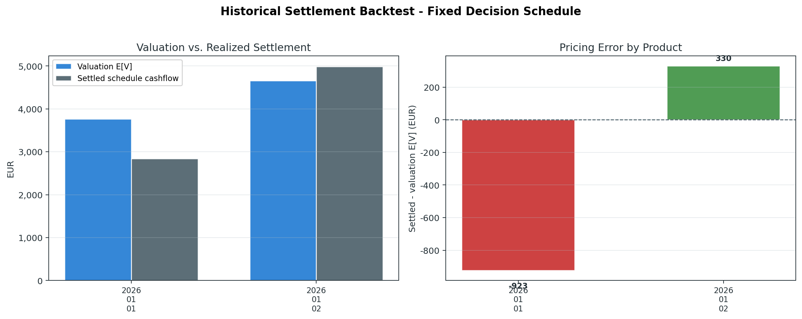

# Historical Settlement Backtest Results

This document records the first historical-analysis layer added to the repo.
It uses the synthetic fixture in `examples/data/historical_products.csv` and is
reproducible with:

```bash
PYTHONPATH=src python examples/run_analyses.py
```

## Scope

The backtest prices each historical product with valuation-time market data,
selects a fixed decision schedule, and settles that schedule against realized
prices. It does not re-optimize on settlement prices.

Current fixture:

- Portfolio: `examples/merchant_bess.json`
- Historical products: `examples/data/historical_products.csv`
- Method: `intrinsic`
- Products: 2 hourly day-ahead-style delivery slices with 4 intervals each

## Results

| Metric | Value |
|---|---:|
| Products | 2 |
| Total valuation E[V] | 8,425 EUR |
| Total settled cashflow | 7,832 EUR |
| Mean valuation E[V] | 4,212 EUR |
| Mean settled cashflow | 3,916 EUR |
| Mean pricing error | -297 EUR |
| Mean absolute error | 627 EUR |
| RMSE | 693 EUR |

Per product:

| Product | Valuation E[V] | Settled cashflow | Error |
|---|---:|---:|---:|
| `day_ahead_2026_01_01` | 3,766 EUR | 2,843 EUR | -923 EUR |
| `day_ahead_2026_01_02` | 4,659 EUR | 4,989 EUR | +330 EUR |



## Interpretation

The first product under-settles versus valuation because the realized spread is
weaker than the valuation-time spread. The second product over-settles because
the realized high-price interval is stronger than expected.

This is a workflow validation result, not a market-performance claim. The
fixture is synthetic and intentionally small. A production-grade historical
study would need real product definitions, timestamps aligned to exchange
delivery products, forecast snapshots, settlement prices, fees, liquidity,
imbalance costs, and out-of-sample regime splits.
